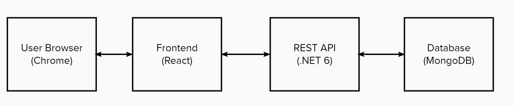
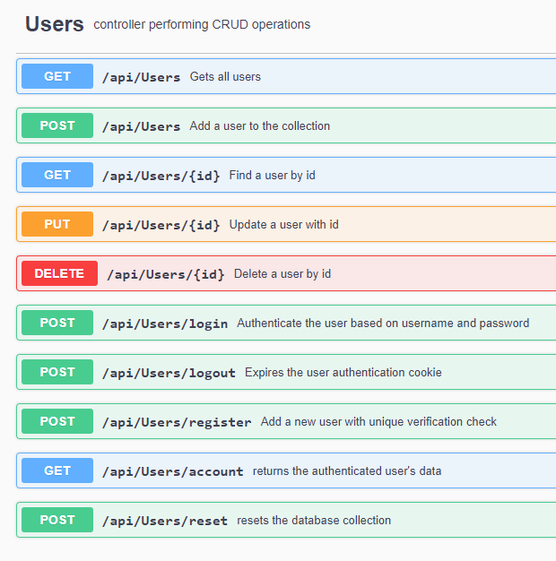

 

<h3 align="center">Capgemini Banking System</h3>

A Internal Capgemini Banking System Project

***

    
Table of Contents

    <ol>
        <li>
            <a href="#team-members">Team Members</a>
        </li>
        <li>
            <a href="#about-the-project">About The Project</a>
            <ul>
                <li><a href="#features">Features</a></li>
                <li><a href="#built-with">Built With</a></li>
                <li><a href="#system-design">System Design</a></li>
            </ul>
        </li>
        <li>
            <a href="#api-documentation">API Documentation</a>
        </li>
        <li>
            <a href="#installation">Installation</a>
        </li>
    </ol>

***

## Team Members
* [Kenny Liang](https://github.com/kennliang) - kenny.liang@capgemini.com
* [Rene Sanger](https://github.com/renesanger) - rene.sanger@capgemini.com
* [Casey Warren](https://github.com/caseywar) - casey.warren@capgemini.com
* [Brishti Saha](https://github.com/sahabr) - brishti.saha@capgemini.com

***

## About The Project
This internal capgemini project is a bank account creation system to gain experience in trained technologies.

## Features
* User Account Registration
* User Account Sign In
* User Account View Information
* User Account Update Information
* User Help Information

## Built With
* [React](https://reactjs.org/) JavaScript library for building user inferfaces
* [React Bootstrap](https://react-bootstrap.github.io/) CSS Framework
* [ASP.NET 6 Web API](https://dotnet.microsoft.com/en-us/download/dotnet/6.0) REST API application in C#
* [MongoDB](https://www.mongodb.com//) Open-Source NOSQL Database System
* [Postman](https://www.postman.com/) API Client for testing REST APIs

## System Design

***

## API Documentation
[Swagger UI API Documentation](https://localhost:7055/swagger/index.html)

***

## Installation

1. Download .NET 6 SDK https://dotnet.microsoft.com/en-us/download/dotnet/6.0
2. Download Node.js https://nodejs.org/en/download/
3. Download MongoDB Community Edition https://docs.mongodb.com/manual/administration/install-community/
4. To run the backend. Change into the bank-backend directory. Run the command "dotnet run"
5. To run the frontend. Change into the bank-frontend directory. Run the command "npm install" and then "npm start"